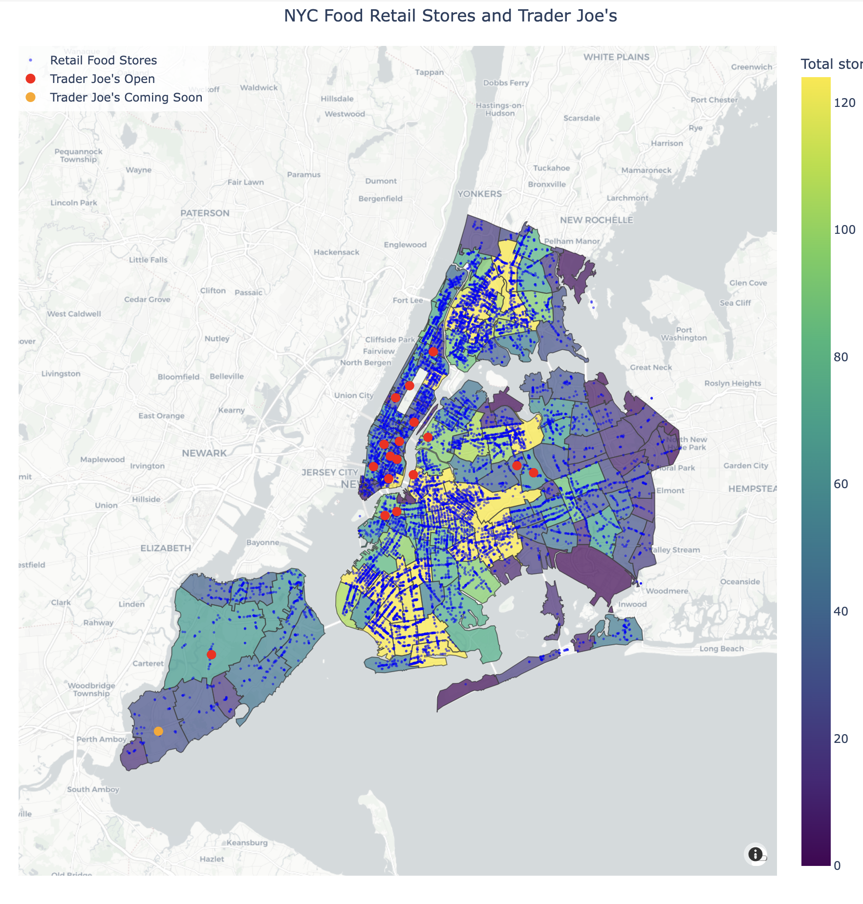

# Trader Joe's NYC Expansion Analysis

## Project Overview


This project analyzes Trader Joe's store locations in New York City to identify patterns and recommend strategic ZIP codes for future expansion. Using demographic data, transit accessibility, and retail environment analysis, we developed a similarity scoring model to identify high-potential neighborhoods that match the profile of successful existing locations.
## Interactive Maps

This project includes several interactive visualizations. You can explore them at:

[Trader Joe's NYC Analysis Dashboard](https://aprilqx.github.io/trader-joes/)

The interactive maps include:
- [Transit Accessibility Analysis](https://aprilqx.github.io/trader-joes/nyc_food_retail_map_population_density.html)
- [Expansion Recommendations Map](https://aprilqx.github.io/trader-joes/trader_joes_recommendations.html)
- [Demographic Comparisons](https://aprilqx.github.io/trader-joes/maps/education_map.html)

## Data Source

* Trader Joe's location data (manually collected)
* NYC demographic data by ZIP code (US Census ACS)
* MTA subway/bus stop data (NYC Open Data)
* NYC FRESH zoning districts (NYC Planning)
* Retail food store location data (NYC Open Data)

## Methodology
We implemented a multi-factor similarity analysis to identify promising expansion locations:

* Feature Selection: Identified key demographic, transit, and retail features that characterize successful Trader Joe's locations
* Similarity Scoring: Developed a weighted scoring system based on distance to the "ideal" Trader Joe's neighborhood profile
* Spatial Analysis: Incorporated transit accessibility, retail competition, and zoning incentives
* Recommendation Ranking: Ranked ZIP codes by overall similarity score, with adjustments for strategic considerations

##  Reproducing the Analysis
* Run the tj_eda.ipynb notebook and data_visualization.ipynb for exploratory analysis and visualization
* Run the TJ_Rec.ipynb notebook to generate recommendations
Interactive maps are saved as HTML files in the output directory
* LaTeX report can be compiled from the report directory


## Setup

```bash
# Clone the repository
git clone https://github.com/AprilQx/data_science_project.git
cd M2_coursework

# Create and activate a virtual environment
python -m venv venv
source venv/bin/activate  # On Windows: venv\Scripts\activate

# Install dependencies
pip install -r requirements.txt
```